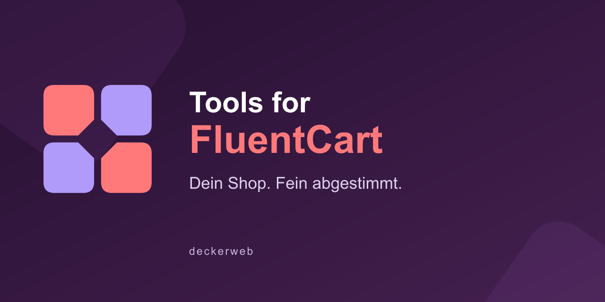

# Tools for FluentCart

## English

**Fine-tune your store.**

Practical tools for your FluentCart shop. The Cart Rules module provides single-item carts, minimum quantities and merchandise value, maximum quantities, and quantity steps.

Version 0.9.0 is being tested. No release has been published yet.

[Repository](https://github.com/deckerweb/tools-for-fluentcart) · [Documentation](https://github.com/deckerweb/tools-for-fluentcart/wiki/Documentation)

## Deutsch

**Dein Shop. Fein abgestimmt.**

Praktische Werkzeuge für deinen FluentCart-Shop. Das Modul Cart Rules bietet Ein-Artikel-Warenkörbe, Mindestmengen und Mindestwarenwert, Höchstmengen und Mengenschritte.

Version 0.9.0 wird getestet. Noch kein Release veröffentlicht.

[Repository](https://github.com/deckerweb/tools-for-fluentcart) · [Dokumentation](https://github.com/deckerweb/tools-for-fluentcart/wiki/Dokumentation)

## Support · Unterstützung

[Ko-fi](https://ko-fi.com/deckerweb) · [Buy Me a Coffee](https://buymeacoffee.com/daveshine) · [PayPal](https://paypal.me/deckerweb)
